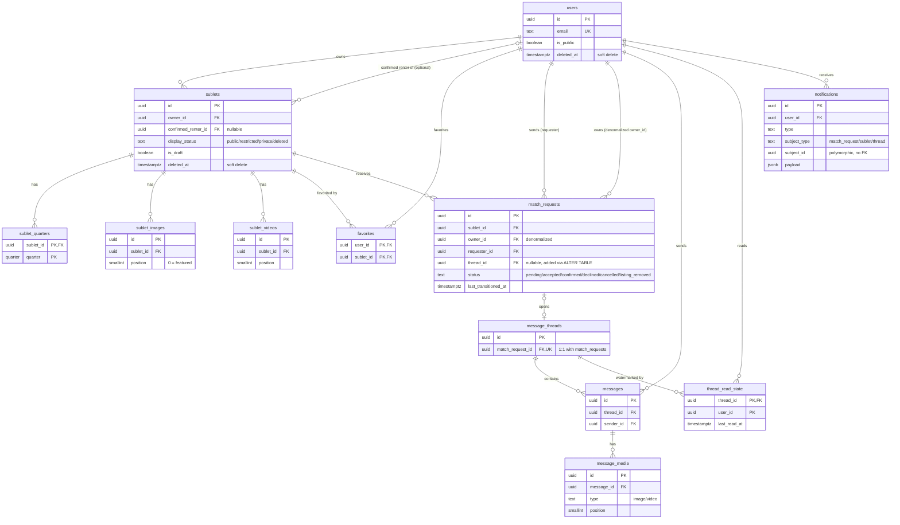

# SubletNU — Entity Relationship Diagram

Reflects `schema.sql` as of 09/07/26. Reference only — no live database yet
(see `schema.sql`'s own header and `.claude/plans/PLAN.md` for the Day 2 vs.
Day 3 split).

## Notes the diagram can't fully express

- **`ON DELETE` policy**: every FK above is `RESTRICT` except `favorites`
  (both FKs `CASCADE`) — see `schema.sql`'s header comment for why favorites
  is the one deliberate exception.
- **`sublets.confirmed_renter_id`** is nullable and only meaningful when
  `display_status = 'restricted'` — it's what makes `'restricted'`
  ("visible to owner + confirmed renter only") different from `'private'`
  ("visible to owner only").
- **`match_requests.thread_id` ↔ `message_threads.match_request_id`** is a
  circular reference. `schema.sql` creates `match_requests.thread_id` as a
  plain nullable column with no inline FK, creates `message_threads`
  afterward, then adds `match_requests`' FK via a separate `ALTER TABLE`.
  The diagram shows the logical 1:1 relationship; the physical creation
  order is documented in `schema.sql` itself.
- **`notifications.subject_id`** is deliberately not a real foreign key —
  it's polymorphic (points into whichever table `subject_type` names), and
  Postgres can't enforce referential integrity across a polymorphic
  reference. Accepted risk, not an oversight — see EXPLAIN_BACK.md.
